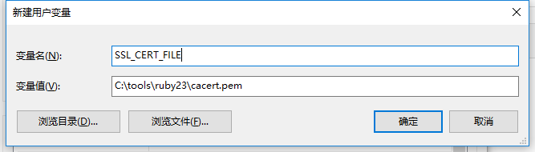
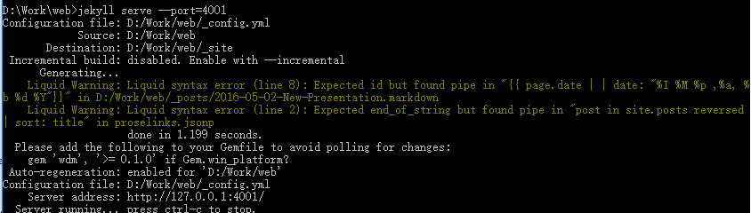

## Windows 安装配置 Jekyll

在 Windows 上比较好的实践是先安装一个 **包管理器(Pakage Manager)**，然后通过包管理器来安装和配置需要的软件，这样软件升级、卸载等都更加方便。Windows 上最流行的包管理器是 [Chocolatey](https://chocolatey.org/)。

### 安装 chocolatey

按照 [chocolatey install](https://chocolatey.org/install) 提示安装 chocolatey。

### 安装配置 Ruby

**以管理员权限打开** CMD，输入

```bash
choco install ruby -y
```

等待安装完成。安装完成后的ruby程序目录在 `C:\tools\ruby[xx]`，`[xx]`为Ruby的版本号。

下载 [http://curl.haxx.se/ca/cacert.pem](http://curl.haxx.se/ca/cacert.pem) 到 `C:\tools\ruby[xx]`目录，然后 [设置用户变量](http://blog.csdn.net/eric_jjc/article/details/5377684) ，添加 `SSL_CERT_FILE`变量。



注销后配置生效。

**以管理员权限打开** CMD，输入

```bash
gem sources --add https://ruby.taobao.org/ --remove https://rubygems.org/
```

修改 gem 源为淘宝镜像，以加速 Jekyll 安装。

### 安装 Jekyll

**以管理员权限打开** CMD，输入

```bash
gem install github-pages 
```

`github-pages` 包括了 Jekyll 和一些其他的工具，且与当前 Github Pages 服务后台生成网页的工具一致，故直接安装 `github-pages` 更方便。

完成安装。

### 测试安装

在网页源代码目录中启动CMD，输入：

```bash
jekyll serve --watch --port=4001
```

出现类似如下信息表示 jekyll 已经能够运行。



浏览器访问 [http://127.0.0.1:4001/](http://127.0.0.1:4001/) 查看网页。

### 参考文档

1. [How to install Jekyll and pages-gem on Windows (x64)](http://jwillmer.de/blog/tutorial/how-to-install-jekyll-and-pages-gem-on-windows-10-x46)
2. [Download a cacert.pem for RailsInstaller](https://gist.github.com/fnichol/867550#the-manual-way-boring) 