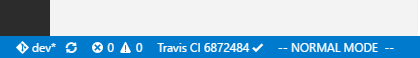

## 最佳实践

本节介绍本地代码编辑、测试和提交的最佳实践。

首先下载安装 [Visual Studio Code](https://code.visualstudio.com/download)。安装完成后启动 Visual Studio Code, 通过 **文件 -> 打开文件夹** 打开网站源码目录。

通过侧边栏选择文件，并在右侧的编辑框中对代码进行修改。

点击 Ctrl+\` 会自动在源代码目录打开 CMD，输入 `jekyll serve --watch` 即可在浏览器中通过 [localhost:4000](localhost:4000) 查看网页。

若是使用 WSL，可以在 Visual Studio Code 的用户配置中添加以下代码将默认终端修改为 Bash

```bash
"terminal.integrated.shell.windows": "C:\\WINDOWS\\sysnative\\bash.exe",
```

点击 `Ctrl + Shift + G`，切换到 Git 面板，可以完成 git 的 add、commit、push 等操作。

推荐安装 Travis CI Status 插件，这样每次推送完成后可以在编辑器左下角查看 Travis CI 构建结果。

