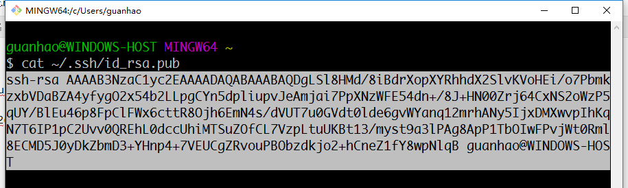
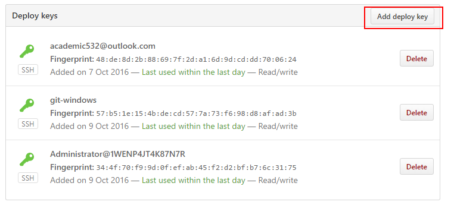
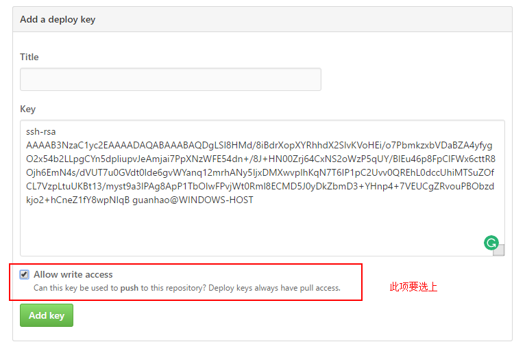
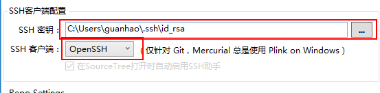
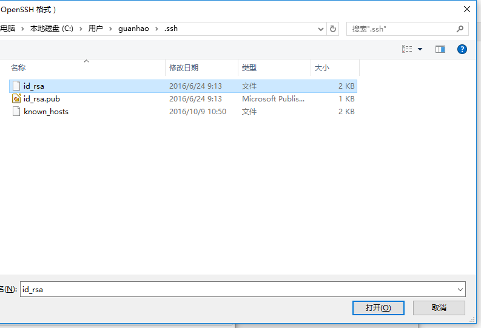
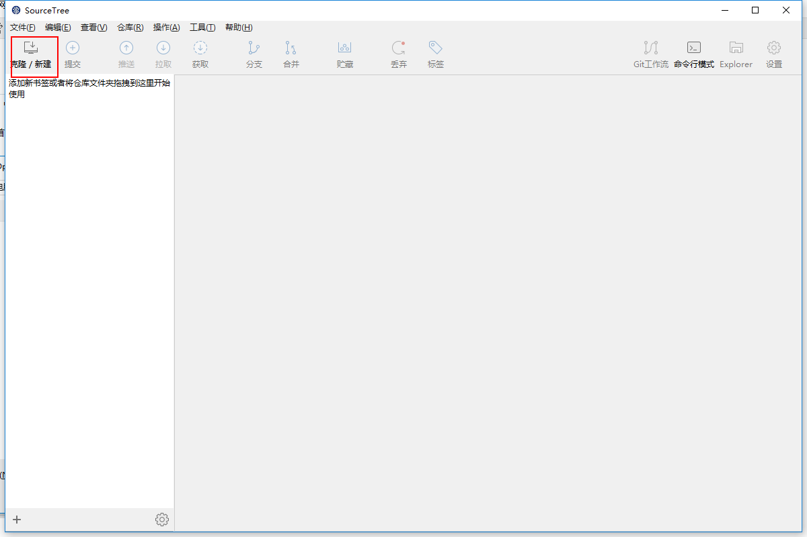
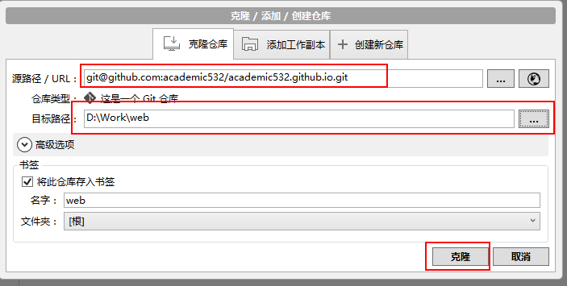
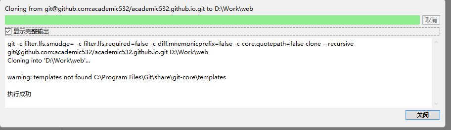
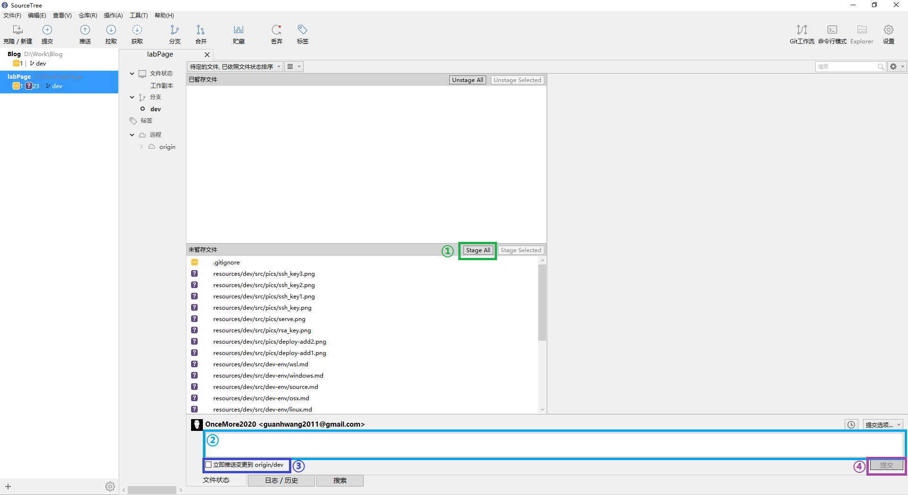

## 版本管理系统

[Git](https://git-scm.com/) 是目前最流行的分布式版本管理系统，越来越多的开源项目使用 Git 作为版本管理系统，最流行的代码托管网站 [Github](https://github.com/) 也使用 Git 作为版本管理系统。本节介绍如何使用 Git 管理代码版本并配合[持续集成](http://www.ruanyifeng.com/blog/2015/09/continuous-integration.html) 服务实现网站的自动化部署。

使用 Git 版本管理系统的理由：

1. 代码的版本迭代更加规范，代码管理更方便
2. 便于多个开发者协作
3. 配置持续集成服务实现自动化部署和交付

### Git 教程

在开始之前，首先了解什么是 Git, 以及 Git 的基础使用，首先阅读以下两份简短的教程：

1. [git - 简明教程](http://rogerdudler.github.io/git-guide/index.zh.html)
2. [常用 Git 命令清单](http://www.ruanyifeng.com/blog/2015/12/git-cheat-sheet.html)

1中介绍了 git 的安装和基本操作的方式，2是一份比较完备的git指令清单。

### SSH密钥

网站代码托管在 [academic532](https://github.com/academic532/academic532.github.io)，关联了 Github Pages 服务，访问 [academic532.github.io](https://academic532.github.io/) 可以查看网页。任何人都可以查看 Github 上的开源仓库，但是只有经过授权的开发者才能对仓库内的源代码进行修改。Git 使用 [SSH 协议](http://www.ruanyifeng.com/blog/2011/12/ssh_remote_login.html) 来完成这个授权过程的安全验证。若某开发者需要向某仓库推送自己的修改，首先需要在本地生成 SSH 钥匙对，然后将公钥添加到 Github 的配置项中。公钥的作用范围分为：

* 局部：只对某仓库有效，即 Deploy Keys，后文介绍如何添加
* 全局：对某账号下的所有仓库有效，不推荐

首先使用账号登录 [Github](https://github.com)。

安装 git（OSX和Linux用户使用包管理器安装，Windows 用户下载安装 [Git for Windows](https://github.com/git-for-windows/git/releases/download/v2.10.1.windows.1/Git-2.10.1-64-bit.exe)）。

安装完成后OSX和Linux用户启动终端，Windows 用户从开始菜单启动 **Git Bash**

输入以下指令生成密钥对

```
ssh-keygen
```

连续三次回车完成密钥对生成。生成的密钥对在用户目录的 `.ssh`文件夹里面。

将公钥内容打印到终端

```
cat ~/.ssh/id_rsa.pub
```



使用鼠标选择公钥字符串，复制到粘贴板。

打开 [https://github.com/academic532/academic532.github.io/settings/keys](https://github.com/academic532/academic532.github.io/settings/keys)

点击 **Add deploy key**



将复制的公钥内容粘贴到 **Key** 文本框里面，**并勾选 Allow write access**，然后点击 **Add key** 完成公钥添加。
 



### git客户端

如果习惯使用命令行git指令进行版本管理，可以略过此小节。介绍一个 git 可视化前端程序 - [SourceTree](https://www.sourcetreeapp.com/)，可以通过用户友好的图形界面进行 git 操作。

开始前确定已经在 Windows 上安装了 [Git for Windows](https://github.com/git-for-windows/git/releases/download/v2.10.1.windows.1/Git-2.10.1-64-bit.exe) 和 SourceTree，并且已经将 SSH 公钥添加到了仓库的 Deploy Keys。

启动 SourceTree，到 **工具 -> 选项 -> 一般** 配置界面


 
首先切换 **SSH 客户端** 为 **OpenSSH**，然后选择 SSH 密钥为用户目录的 `.ssh` 文件夹内的 `id_rsa` 私钥文件。


 
点击确定完成配置。
 
点击 **克隆/新建**



在 **源路径 /URL** 里填入 `git@github.com:academic532/academic532.github.io.git`，然后在 **目标路径** 里面选择存放仓库的本地目录。建议将本地目录设置为方便查看的位置，便于文本编辑器修改代码。



点击 **克隆**，等待片刻，克隆成功。在本地目录（`D:\Work\web`）内即为网站的源代码。



### 推送修改



编辑代码造成的改动在 SourceTree 中均可以观察到，若要提交当前的修改，按以下步骤操作：

1. **Stage All** 或者 **Stage Selected** 添加所有改动或选定的改动到暂存区；
2. 对本次提交进行说明
3. 选定 **立即推送变更到origin/dev**
4. 点击 **提交** 完成推送。

推送完成后到 [commits](https://github.com/academic532/academic532.github.io/commits/dev) 查看提交记录，找到自己的提交记录，记录后面会显示 Travis CI 构建的状态，若为绿色的钩，则表示本次提交构建成功，已经合并到 `master` 分支，查看网页则可看到改动。

### 管理哲学

Github Pages 服务根据 `master` 分支的内容在后台自动使用 `github-pages` 工具编译网页源码，然后将生成的网页源码(`_site`) 部署到 [academic532.github.io](https://academic532.github.io/)。因此每次 `master` 分支内代码的更新都会触发 Github Pages 服务构建网页源码并部署。

因此，`master` 分之内的代码和展示给网站用户的内容直接关联，因此为了保持规范和避错，我们规定，`master` 分支的内容的改动必须在经过测试后才能生效。因此，添加了一个分支 `dev`，所有对网站源代码的改动，都在 `dev` 分支上测试后再合并进 `master` 分支，并且进一步规定 `master` 分支不能人为地修改，网站开发者只能在 `dev` 分支上改动代码和提交自己的修改。

每次推送到 `dev` 分支的提交，都会自动触发 [Travis CI](https://travis-ci.org) 持续集成服务的自动编译，若编译没有报错，则会自动地推送到 `master` 分支，从而完成对网站内容的修改。若编译报错，该次修改将不会推送到 `master` 分支。Travis CI 端的配置细节，参考[Travis CI Push 权限配置](https://oncemore2020.github.io/blog/travis-deploy/)，一般网站开发者可以略过该部分。

### 参考文档

1. [持续集成是什么？](http://www.ruanyifeng.com/blog/2015/09/continuous-integration.html)
2. [git - 简明教程](http://rogerdudler.github.io/git-guide/index.zh.html)
3. [常用 Git 命令清单](http://www.ruanyifeng.com/blog/2015/12/git-cheat-sheet.html)
4. [Travis CI Push 权限配置](https://oncemore2020.github.io/blog/travis-deploy/)
