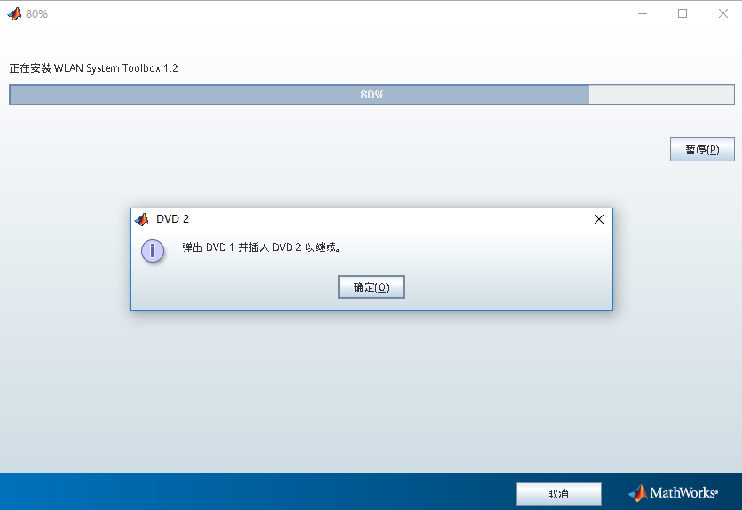

# Matlab 安装指南

本节介绍如何在 Linux 操作系统中安装 Matlab。

以 `Matlab 2016b Linux64` 版本为例，安装文件包括：

* `R2016b_glnxa64_dvd1.iso`
* `R2016b_glnxa64_dvd2.iso`

## 挂载 DVD1

```bash
$ sudo mkdir /media/mathworks -p
$ sudo mount -t iso9660 -o loop R2016b_glnxa64_dvd1.iso /media/mathworks
$ sudo mkdir /opt/MATLAB/R2016b
$ sudo chmod 777 /opt/MATLAB/R2016b -R
```

## 启动安装程序

```bash
$ /media/mathworks/install
```

启动安装程序，注意安装位置选择 `/opt/MATLAB/R2016b`。

## 挂载 DVD2

出现如下界面时



输入

```bash
$ sudo umount /media/mathworks
$ sudo mount -t iso9660 -o loop R2016b_glnxa64_dvd2.iso /media/mathworks
```

卸载 DVD1，挂载 DVD2，回到安装界面继续安装。