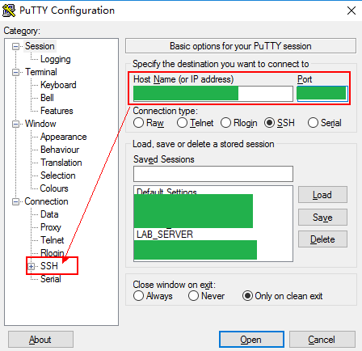
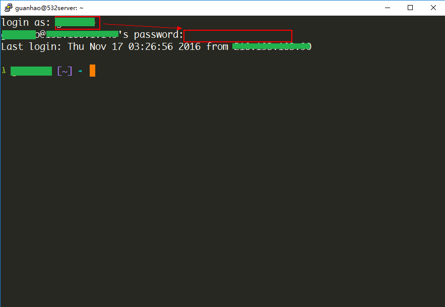
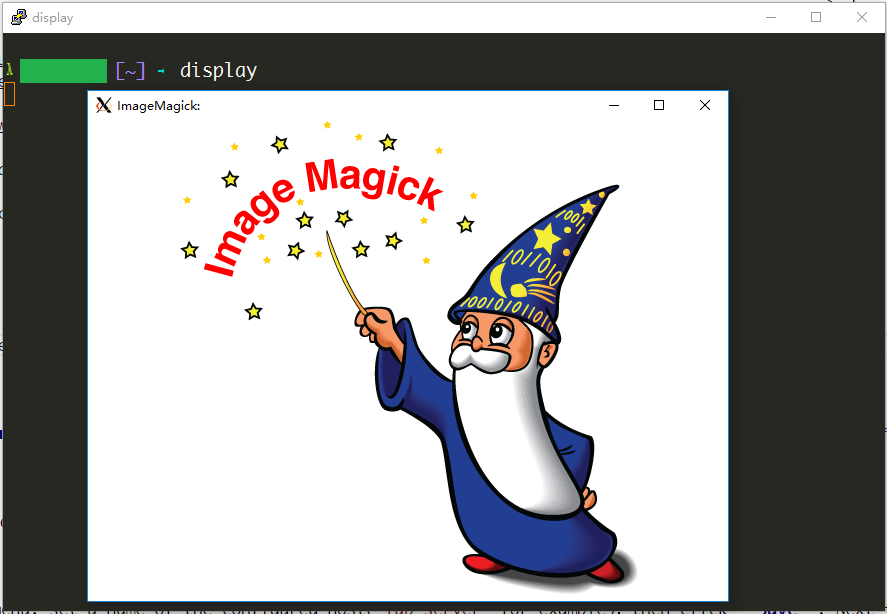

## Apply for account

Firstly, ask the administrator for a user account, including the host and port information of the VPS.

## Prerequisites

Before getting started, make sure that newer stable versions of the softwares listed below have been installed(depend on the OS of your desktop):

- Windows
    * [Xming](https://sourceforge.net/projects/xming/)
    * [Putty](https://the.earth.li/~sgtatham/putty/latest/w64/putty-64bit-0.68-installer.msi)
- MacOS
    * [XQuartz](https://www.xquartz.org/)
- Linux
    * [Batteries Included](https://en.wikipedia.org/wiki/Batteries_Included_\(slang\))


## Get started

### Windows

Run **Xming** from start menu, then start **Putty**.



set **Host Name (or IP address)** and **Port**, then expand the sub-menu **SSH** in **Category** pane.


Go to **X11** sub-menu, and check the **Enable X11 forwarding** option.


Go back to **Session** menu, set a name of the configured host(`lab_server` for example)，then click **Save**. Next time you start Putty, the configuration will be in the **Saved Sessions** list.

Choose the session you just saved, and click **Open**, a command line interface will prompt you to input the username and password of your account.



input your username and password, then hit ENTER to login, the terminal interface is here.

you can test the X11 forwarding by running some applications with graphical interface, for instance

```bash
display
```



**Note**: `display` is a member program of ImageMagick, which can be used to display image on X server.

### MacOS

Start **XQuartz** from Launchpad, then open built-in terminal of OS X, input

```bash
ssh -Y -p [port] [username]@[hostname]
``` 

to connect to the server.

### Linux

Common Linux disitributions(Ubuntu, Fedora) with Desktop Environment have X11 server installed already, so open terminal  directly and input

```bash
ssh -Y -p [port] [username]@[hostname]
``` 

to connect to the server.
