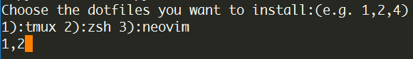
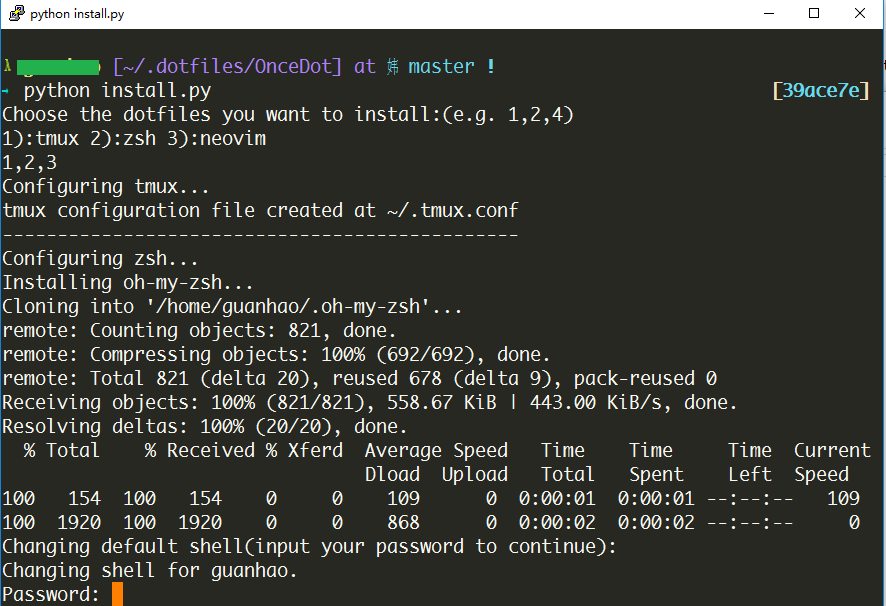

## User-friendly Shell

### Use zsh as default shell

The default terminal interface may be ugly since some of the fonts required is not installed on your OS, nevertheless you can switch to a more user-friendly command line interface, which can be done by following commands listed below:

Login into your terminal, input

```bash
mkdir .dotfiles
cd .dotfiles
git clone https://github.com/OnceMore2020/OnceDot.git
cd OnceDot
python install.py
```

when you see the message below, input `1,2` then hit ENTER.



the script may ask you to input your password to finish the configuration.



When the script quits without error, logout by typing `exit` in the terminal, and re-login to your user account.

### Source Code Pro

Some fonts are designed to be more compatible with command line, *Adobe Source Code Pro* is one of them, and is recommended to be used as the default font of your terminal user interface.


Download latest release of [Adobe Source Code Pro](https://github.com/adobe-fonts/source-code-pro/releases) and install the **Regular** font.

Change the font of your terminal to Source Code Pro, for example, using Putty, go to the submenu - **Window \| Appearance** and change to font to Source Code Pro.