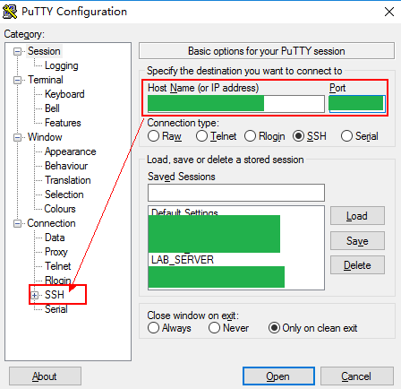
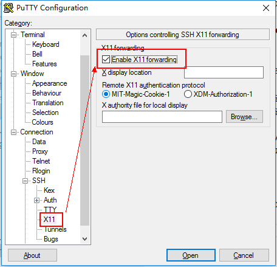
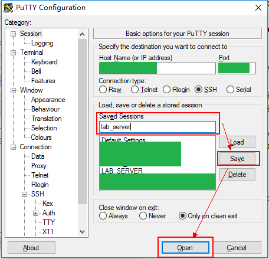
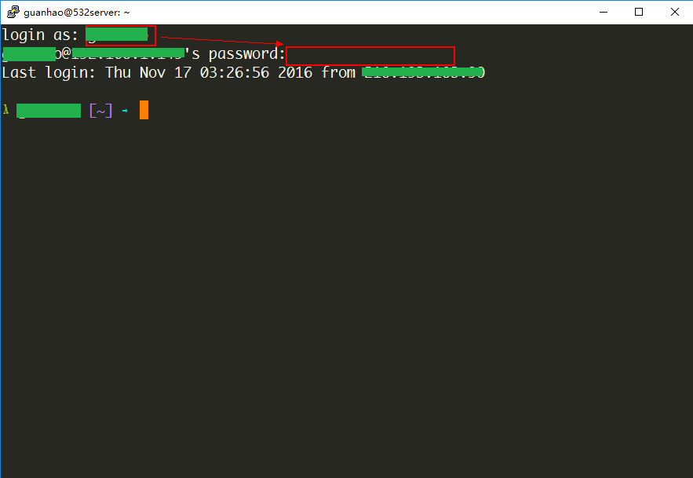
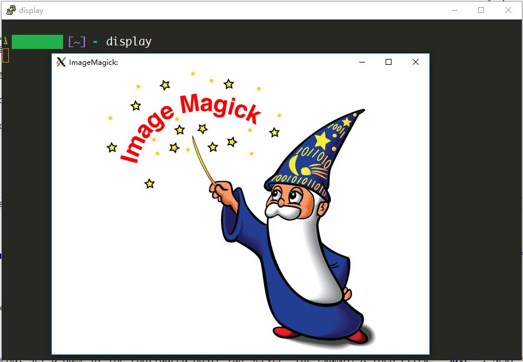
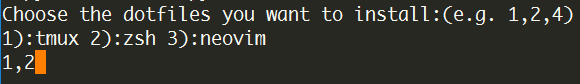
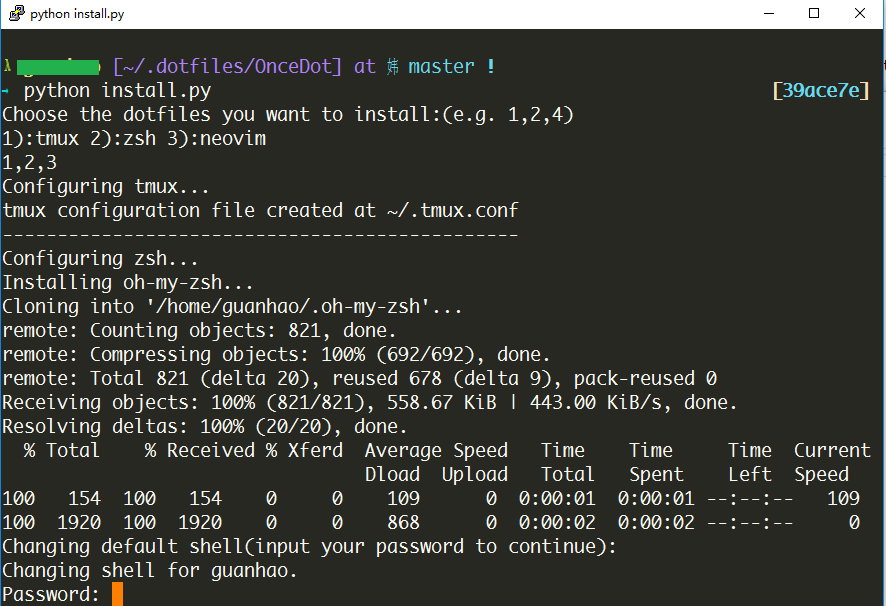

# VPS Service

**VPS(Virtual Private Server)** provides alternative computational resources which could be much faster than desktop PC, therefore it can be used for compute-intensive tasks.

This section provides a tutorial to access VPS service hosted on lab server.

## Apply for account

Firstly, ask the administrator for a user account, including the host and port information of the VPS.

## Prerequisites

Before getting started, make sure that newer stable versions of the softwares listed below have been installed(depend on the OS of your desktop):

- Windows
    * [Xming](https://sourceforge.net/projects/xming/)
    * [Putty](https://the.earth.li/~sgtatham/putty/latest/x86/putty.exe)
- MacOS
    * [XQuartz](https://www.xquartz.org/)
- Linux
    * [Batteries Included](https://en.wikipedia.org/wiki/Batteries_Included_(slang))

Note that Putty is self-contained portable software, you can run it directly without manual installation.

## Get started

### Windows

Run **Xming** from start menu, then double-click on `putty.exe` to start **Putty**.



set **Host Name (or IP address)** and **Port**, then expand the sub-menu **SSH** in **Category** pane.



Go to **X11** sub-menu, and check the **Enable X11 forwarding** option.



Go back to **Session** menu, set a name of the configured host(`lab_server` for example)，then click **Save**. Next time you start Putty, the configuration will be in the **Saved Sessions** list.

Choose the session you just saved, and click **Open**, a command line interface will prompt you to input the username and password of your account.



input your username and password, then hit ENTER to login, the terminal interface is here.

you can test the X11 forwarding by running some applications with graphical interface, for instance

```bash
display
```



**Note**: `display` is a member program of ImageMagick, which can be used to display image on X server.

### MacOS

Start **XQuartz** from Launchpad, then open built-in terminal of OS X, input

```bash
ssh -X -p [port] [username]@[hostname]
``` 

to connect to the server.

### Linux

Familiar with MacOS, open terminal and input

```bash
ssh -X -p [port] [username]@[hostname]
``` 

to connect to the server.

## User-friendly Shell

### Use zsh as default shell

The default terminal interface may be ugly since some of the fonts required is not installed on your OS, nevertheless you can switch to a more user-friendly command line interface, which can be done by following commands listed below:

Login into your terminal, input

```bash
mkdir .dotfiles
cd .dotfiles
git clone https://github.com/OnceMore2020/OnceDot.git
cd OnceDot
python install.py
```

when you see the message below, input `1,2` then hit ENTER.



the script may ask you to input your password to finish the configuration.



When the script quits without error, logout by typing `exit` in the terminal, and re-login to your user account.

### Source Code Pro

Some fonts are designed to be more compatible with command line, *Adobe Source Code Pro* is one of them, and is recommended to be used as the default font of your terminal user interface.


Download latest release of [Adobe Source Code Pro](https://github.com/adobe-fonts/source-code-pro/releases) and install the **Regular** font.

Change the font of your terminal to Source Code Pro, for example, using Putty, go to the submenu - **Window \| Appearance** and change to font to Source Code Pro.
